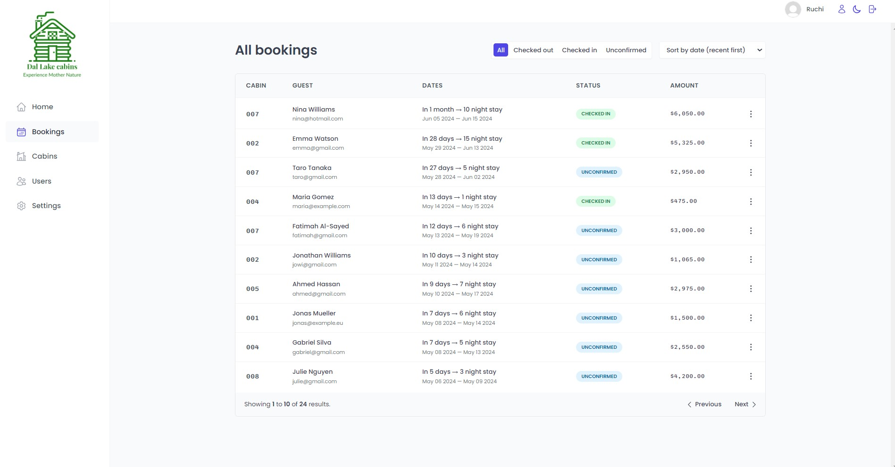

 
 

 

The Dal Lake Cabins app enables you to check in/out bookings and gain a complete understanding of bookings, sales, check-ins, occupancy rates.

  
• <a href="#technologies-used" align="center">Technologies Used</a> •  <a href="#screenshot" align="center"> Screenshot </a>  •  <a href="#main-features-of-the-app" align="center"> Main Features of the App </a> • <a align="center" href="#future-enhancements"> Future Enhancements </a> •  <a href="#license" align="center"> License  </a>

## Technologies Used

- [React](https://react.dev/)
- [React Router Dom](https://reactrouter.com/en/main)
- [Styled componenets](https://styled-components.com/)
- [React Query](https://tanstack.com/query/v3/)
- [React Hook Form](https://www.react-hook-form.com/)
- [Supabase](https://supabase.com/)

## Screenshot

  
  
  
  

## Main Features of the App

- Users of the app are hotel employees.They need to be logged into the application to perform tasks.
- New users can only be signed up inside the applications(to guarantee that only actual hotel employees can get accounts)
- Users should be able to upload an avatar, and change their name and password
- App needs a table view with all cabions , showing the cabin photo,name , capacity , price and current discount.
- Users should be able to update or delete a cabin , and to create new cabins (including uploading a photo)
- App needs a table view with all the bookings , showing arrival and departure dates,status and paid amount, as well as cabin and guest data.
- The booking status can be 'unconfirmed' (booked but not yet checked in), "checked in" or "checked out".The table should be filterable by this important status.
- Other booking data includes : number of guests , number of nights , guest observations , whether they booked breakfast,breakfast price.
- Users should be able to delete , check in , or check out a booking as the guest arrives (no editing necessary for now).
- Bookings may not have been paid yet on guest arrival . Therefore , on check in , users need to accept payment (outisde the app), and then confirm that payment has been received (inside the app).
- On check in , the guest should have the ability to add breakfast for the entire stay, if they hadn't already.
- Guest data should contain : full name , email , national ID , nationality and a country flag for easy identification.
- The initial app screen should be a dashboard, to display important information for the last 7,30 and 90 days.
  - A list of guests checking in and checking out on the current day.Users should be able to perform these tasks from here
  - statistics on recent bookings, sales,check ins and occupancy rate
  - a chart showing all daily hotel sales , showing both "total" sales and "extras" sales (only breakfast at the moment)
  - A chart showing statistics on stay durations , as this is an important metric for the hotel.
- Users should be able to define a few application-wide settings : breakfast price,min and max nights/booking,max guests/booking.
- App needs a dark mode.

## Future Enhancements

- Create new bookings
- Edit booking
- Varying prices of rooms
- Restaurant order and adding it to total bill
- PDF invoice after checkout and mail to the user

## License
**MIT**
